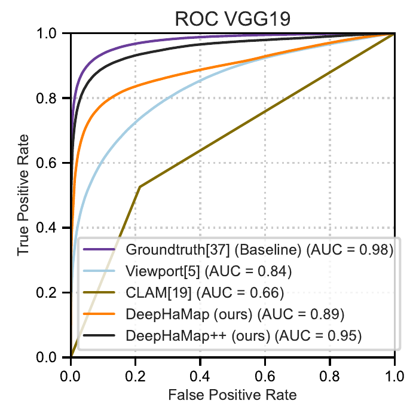
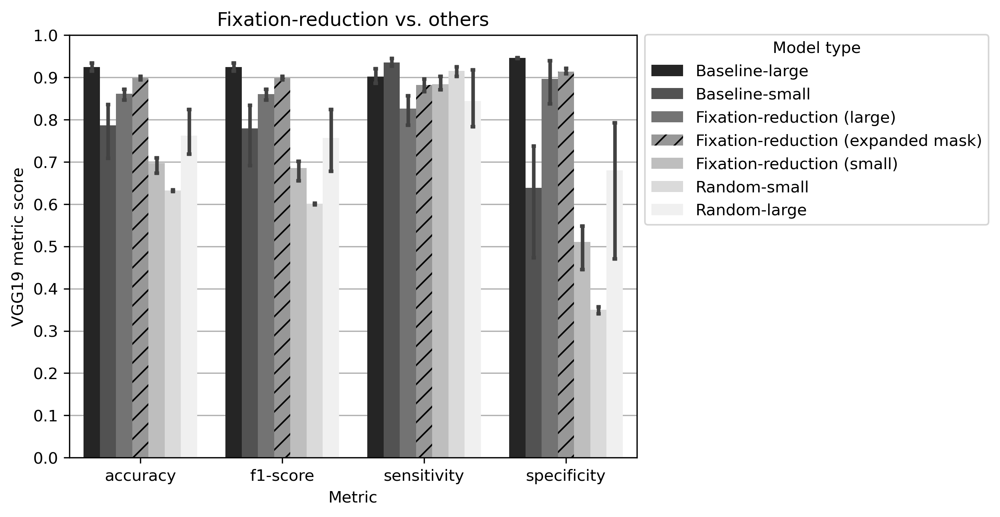
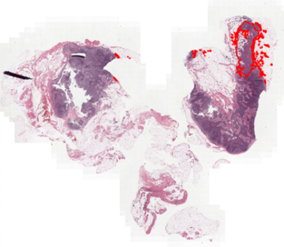
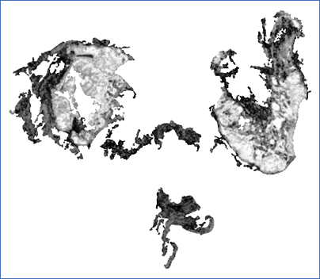
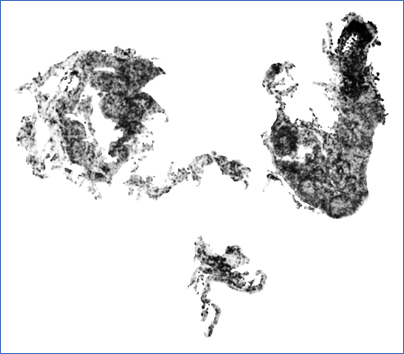

# HaMap: Habit-Based Fixation Saliency for Whole-Slide Imaging

Pathologists are trained experts of habit, frequently inspecting information-bearing regions during routine whole-slide image (WSI) review. This project investigates whether such human visual habits can be harvested as an *annotation-free* supervisory signal for detecting cancerous tissue.

We introduce **HaMap**, a habit-based fixation saliency map derived from routine WSI readings. Using HaMap to guide an ensemble supervised learning pipeline, we achieve:

- **AUC:** 0.95  
- **Precision:** 0.90 (whole-slide diagnostic classification)  
- **FROC:** 0.16 (tile-level lesion localization)

We validate HaMap’s reliability using four independent experiments. The results show:

- Fixation-derived saliency contains informative signals capable of achieving **higher diagnostic precision (0.90)** than pathologists alone (~0.75).
- HaMap outperforms viewport-based and weakly supervised learning baselines.
- **HaMap++** provides additional gains by fine-tuning weakly supervised models for slide-level classification.
- Our annotation-free data collection method integrates seamlessly with daily clinical workflows and can scale across institutions.

While whole-slide classification performance is strong, tile-level localization remains an area for further improvement.

This repository contains code, pipelines for generating HaMap and HaMap++, and tools for evaluating saliency-guided diagnostic algorithms. Metadata and reference files are included in `data/raw/`; larger datasets (WSI, eye-tracking data, predictions) must be downloaded separately (see Data section below).

---

## Data

### CAMELYON16 Dataset
Download the CAMELYON16 whole-slide images, ground truth masks, and related data from the official challenge website:
- **Official site:** https://camelyon16.grand-challenge.org/Data/

### Eye-tracking Data and HaMap Results
Eye-tracking data, HaMap masks, and HaMap++ predictions are available at:
- **OSF:** https://osf.io/hj9a7
- **Google Drive:** See the folder link referenced in the paper

We captured eye-tracking and mouse movement data for all participant-image pairs, recording:
- **Saccades** (eye movements between fixations, shown as black lines)
- **Fixations** (gaze points, shown as colored dots with size/color indicating duration)
- **Zoom levels** at each fixation (shown as blue vertical bars)
- **Mouse movements** during slide review

<table>
  <tr>
    <td></td>
    <td></td>
  </tr>
  <tr>
    <td colspan="2" align="center"><i>Examples of pathologist's viewing behavior showing saccades, fixations, and zoom levels</i></td>
  </tr>
</table>

---

## Results

### Localization Examples with HaMap and HaMap++
<table>
  <tr>
    <td width="50%"></td>
    <td width="50%"></td>
  </tr>
  <tr>
    <td align="center"><i>HaMap mask based on pathologist's fixations</i></td>
    <td align="center"><i>HaMap++ mask from HaMap-based DeepHaNet predictions</i></td>
  </tr>
</table>

### WSI Tile Classification Performance
<p align="center">
  
</p>
<p align="center"><i>ROC curves and AUC values for test set tile classification comparing Ground truth, Viewport method, weakly supervised CLAM model, DeepHaNet (HaMap-based), and DeepHaNet++ (HaMap++-based).</i></p>

### Comparison of Different Models
<p align="center">
  
</p>
<p align="center"><i>Classification metrics on the test set comparing baseline ground truth-trained models (Large: all train tumor slides, Small: random 20 tumor slides), Fixation-reduction (small): HaMap-based DeepHaNet using 20 HaMaps, Random-small: 20 tumor slides with randomly sampled tiles, and Random-large: all train tumor slides with random sampling.</i></p>

### Weakly Supervised Tumor Localization with CLAM
<table>
  <tr>
    <td width="33%" align="center"></td>
    <td width="33%" align="center"></td>
    <td width="34%" align="center"></td>
  </tr>
  <tr>
    <td align="center"><i>Ground truth tumor region</i></td>
    <td align="center"><i>CLAM original (ImageNet pretrained ResNet50)</i></td>
    <td align="center"><i>CLAM using DeepHaNet-finetuned ResNet50</i></td>
  </tr>
</table>
<p align="center"><i>Attention-based heatmaps for tumor localization using the CLAM pipeline, comparing original ImageNet-pretrained features vs. DeepHaNet-finetuned features. Heatmaps are shown in grayscale where darker regions indicate higher tumor probability. In this example, DeepHaNet-finetuned CLAM better identifies the tumor region but produces more false positives in normal tissue areas.</i></p>

---

## Environment Setup

This project was developed and tested using Python 3.9 and Conda.

**Main environment (hamap):**
```
conda env create -f environment.yml
conda activate hamap
```

---

## Usage Pipeline

After setting up the environment, follow these steps to reproduce the HaMap pipeline:

### 1. Extract Tiles
Extract tissue tiles from whole-slide images using scripts in `code/preprocessing/tilling/`.

### 2. Stain Normalize Tiles
Normalize the extracted tiles using `code/preprocessing/stain_norm/` (see Stain Normalization section below).

### 3. Train and Test Models
Train and test models using scripts in `code/models/training/` (see Train and Test a Model section below).

### 4. Run Analyses
Perform analyses using scripts in `code/analysis/`. Examples:
- `Cal_overlap_Dice_AUC_sAUC.py` - Calculate overlap, Dice, AUC, and sAUC metrics
- `Analyze_FROC_score.ipynb` - Analyze FROC scores

---

## Stain Normalization Environment (stainenv)

Stain normalization of tissue tiles requires a separate Conda environment due to specific dependencies (e.g., staintools, spams).

To set up the `stainenv` environment:

1. Create the environment from the provided YAML file:
	```
	conda env create -f stainenv.yml
	conda activate stainenv
	```

2. Run stain normalization scripts (batch split recommended):
	```
	python stain_normalize_tiles_split.py -d <tile_dir> -n <num_batches> -b <batch_num>
	```
	Example:
	```
	python stain_normalize_tiles_split.py -d train/tumor/fixation_reduction_0.5_s6 -n 10 -b 1
	```
	This splits the tiles into 10 batches and processes batch 1. Adjust `-b` for other batches.

---

## Train and Test a Model

To train and test a model:

```bash
cd code/models/train-test/
python modelDense256_vgg19_train_test.py -d tumor_0.3_s16
```

Where:
- `-d` specifies the directory name for the training data
- `0.3` represents the HaMap threshold level
- `s16` indicates random seed 16

---

## Generate Whole-Slide Predictions (HaMap++)

To generate whole-slide predictions using the DeepHaNet model for HaMap++:

```bash
cd code/models/hamap_pp/
python modelDense256_vgg19_test_expanded_hdf5.py -s <slide_name>
```

Example:
```bash
python modelDense256_vgg19_test_expanded_hdf5.py -s normal_006
```

This generates tile-level predictions for the entire slide from HDF5-stored tiles. The predictions are saved to `whole_slide_prediction/<slide_name>.csv` and form the basis for HaMap++ analysis.

**Requirements:**
- Tiles are stored in HDF5 format at `/fs/ess/PAS1575/stain_norm_tiles_h5py/<slide_name>.hdf5`
- Pre-trained model: `vgg19_models/TNsep_tumor_s26.h5`

---

## Additional Results and Figures

### Analysis Notebooks
Key analysis notebooks are available in `code/analysis/`:
- `Analyze_FROC_score.ipynb` - FROC score analysis
- `Analyze_ablation_results.ipynb` - Ablation study results
- `slide_classification.ipynb` - Slide-level classification analysis
- `eyetracking/` - Eye-tracking visualization notebooks

### Result Figures
Result plots are organized in `figures/`:

**HaMap Results** (`figures/hamap_results_plots/`):
- `AUC_compare_voting.png` - AUC comparisons across voting strategies
- `exp1_cohen_kappa.png` - Inter-rater agreement analysis
- `exp1_result_voting_f1.png` - Voting results with F1 scores
- `exp1_compare_wt_baseline_*.png` - Comparison with baseline methods
- `exp2_compare_gaze_maps_*.png` - Gaze map comparison metrics
- `num_fixation_tiles.png` - Fixation tile distribution

**HaMap++ Results** (`figures/hamap_pp_results_plots/`):
- `expX_model_comparison*.png` - Model performance comparisons
- `mask_comparison_*.png` - Mask precision/recall analysis
- `CLAM_vs_supervised_*.png` - CLAM vs supervised learning comparison

**Ablation Studies** (`figures/ablation/`):
- `FROC_and_FP_analysis.png` - FROC score and false positive analysis
- `roc_all_vs_voting_with_f1.png` - ROC curves comparing all models vs voting with F1 scores

**Eye-tracking Visualizations** (`figures/eyetracking/`):
- Pathologist viewing behavior examples with saccades, fixations, and zoom levels

---

